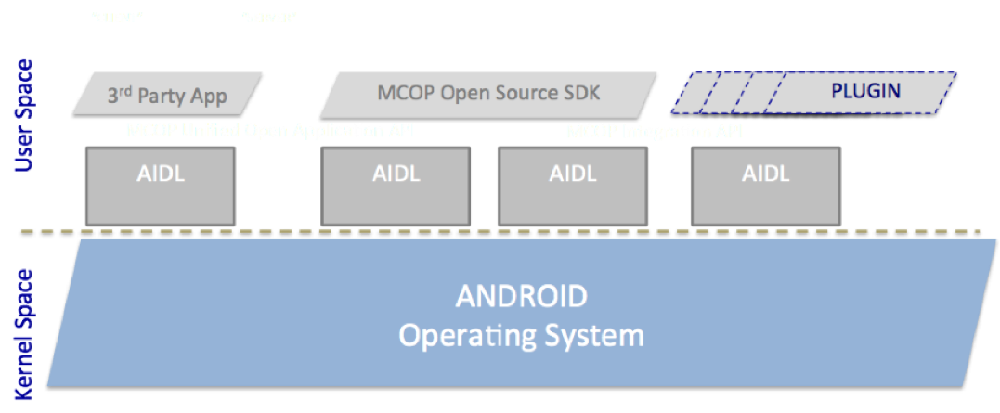

> *Refer to* [*README*](../README.md) *for main instruction file*

# MCOP - MCPTT App Development

## What is MCOP?

**MCOP** (Mission Critical Open Platform) is a project that defines the first prototype of open source **MCPTT** (Mission Critical Push-To-Talk) client.

This client allows the interoperability among different vendors thanks to a multilevel API.

## Architecture

Three main modules define the architecture: 

* **MCOP SDK**:

	This module contains all the MCPTT logic, and allows the use of other additional modules that increase its functionality. 

* **MCOP Integration Plugins**:

	Additional modules or Android services with their own API, known by the MCOP SDK module, offering device specific or MCPTT network required functionalities. 

* **End User Interface**:

	GUI (Graphical User Interface) that uses the MCOP SDK services without having to develop the whole MCPTT logic. *(Min. level of Android SDK: API 17)*.

## App Developing Steps

* **0. MCOP SDK and AIDLs**: The SDK defines two AIDLs and one Constant class:

	* **IMCOPsdk**: From Client to SDK.

	* **IMCOPCallBack**: From SDK to Client.

	* **ConstantsMCOP**: defines the constants to use in the AIDLs.

* **1. Configure Manifest**: Indicate the necessary permissions for the application.

		<uses-permission android:name="android.permission.INTERNET" />
    	<uses-permission android:name="android.permission.ACCESS_WIFI_STATE" />
    	<uses-permission android:name="android.permission.ACCESS_NETWORK_STATE" />
    	<uses-permission android:name="android.permission.CHANGE_WIFI_STATE" />
    	<uses-permission android:name="android.permission.CHANGE_NETWORK_STATE" />
    	<uses-permission android:name="android.permission.WRITE_EXTERNAL_STORAGE" />
    	<uses-permission android:name="android.permission.CAMERA" />
    	<uses-permission android:name="android.permission.WAKE_LOCK" />
    	<uses-permission android:name="android.permission.RECORD_AUDIO" />
    	<uses-permission android:name="android.permission.MODIFY_AUDIO_SETTINGS" />
    	<uses-permission android:name="android.permission.VIBRATE" />
    	<uses-permission android:name="android.permission.RECEIVE_BOOT_COMPLETED" />
    	<uses-permission android:name="android.permission.WRITE_SETTINGS" />
    	<uses-permission android:name="android.permission.DISABLE_KEYGUARD" />
    	<uses-permission android:name="android.permission.READ_CONTACTS" />
    	<uses-permission android:name="android.permission.WRITE_CONTACTS" />
    	<uses-permission android:name="android.permission.READ_PHONE_STATE" />
    	<uses-permission android:name="android.permission.PROCESS_OUTGOING_CALLS" />
    	<uses-permission android:name="android.permission.CALL_PHONE" />
    	<uses-permission android:name="android.permission.RAISED_THREAD_PRIORITY" />
    	<uses-permission android:name="android.permission.ACCESS_FINE_LOCATION" />
    	<uses-permission android:name="android.permission.ACCESS_COARSE_LOCATION" />

* **2. Require the explicit acceptance of some of the permissions.**

	The client should explicitly accept some permissions:

	* Manifest.permission.ACCESS\_FINE\_LOCATION

	* Manifest.permission.READ\_PHONE\_STATE

	* Manifest.permission.ACCESS\_COARSE\_LOCATION

	* Manifest.permission.CAMERA

	* Manifest.permission.RECORD\_AUDIO

		

* **3. Bind to MCOP SDK**:

	In this version of MCOP SDK, it is necessary to send **“currentProfile”** to the service:

		Intent serviceIntent = new Intent()
			.setComponent(new ComponentName(
				"org.mcopenplatform.muoapi",
				"org.mcopenplatform.muoapi.MCOPsdk"));

		serviceIntent.putExtra("PROFILE_SELECT",currentProfile);
		
		try{
                ComponentName componentName;
                if (Build.VERSION.SDK_INT >= Build.VERSION_CODES.O) {
                    componentName = this.startForegroundService(serviceIntent);
                } else {
                    componentName = this.startService(serviceIntent);
                }
                if(componentName==null){
                    Log.e(TAG,"Starting Error: "+componentName.getPackageName());
                }else if(serviceIntent==null){
                    Log.e(TAG,"serviceIntent Error: "+componentName.getPackageName());
                }else if(mConnection==null){
                    Log.e(TAG,"mConnection Error: "+componentName.getPackageName());
                }else{

                }
            }catch (Exception e){
                if(BuildConfig.DEBUG)Log.w(TAG,"Error in start service: "+e.getMessage());
            }

	Wait for the service to bind:

	* Save the return value from the Service (this is the AIDL Interface to be used by the Client to communicate with the Service).

	* Register the callback for asynchronous communication from the Service to the Client:

			mConnection = new ServiceConnection() {
			
			@Override
                public void onServiceConnected(ComponentName className, IBinder service) {
                    mService = IMCOPsdk.Stub.asInterface(service);

                    try {
                        mService.registerCallback(mMCOPCallback);
                    } catch (RemoteException e) {
                        e.printStackTrace();
                    }
                    isConnect=true;

                    // Auto Registration
                    if (autoRegister) {
                        final Handler handler = new Handler();
                        handler.postDelayed(new Runnable() {
                            @Override
                            public void run() {
                                register();
                            }
                        }, DEFAULT_REGISTER_DELAY);
                    }
                }

	* Definition of the registered callback:

		* This is the point where communications from the Server to the Client will be received:

				mMCOPCallback=new IMCOPCallback.Stub() {
					@Override
					public void handleOnEvent(final List<Intent> actionList) throws RemoteException {
						runOnUiThread(new Runnable() {
							@Override
							public void run() {
								for(Intent action:actionList){
									int codeError=-1;
									int eventTypeInt=-1;
									String stringError=null;
									String sessionID=null;
									if(action!=null &&
										action.getAction()!=null &&
										!action.getAction().trim().isEmpty())
											try {
												switch (ConstantsMCOP.ActionsCallBack.fromString(action.getAction())){
												...
												}
											}catch (Exception ex){
												Log.e(TAG,"Event Action Error: "+action.getAction()+" error:"+ex.getMessage());
											}
									}
								}
							});
						}
					};

* **4. Perform any action in the MCOP SDK and receive the result**.

	Example:

		if(mService!=null)
			mService.makeCall(
				selGroup, //DEFAULT_GROUP,
				ConstantsMCOP.CallEventExtras.CallTypeEnum.Audio.getValue()|
				ConstantsMCOP.CallEventExtras.CallTypeEnum.WithFloorCtrl.getValue()| 
				ConstantsMCOP.CallEventExtras.CallTypeEnum.PrearrangedGroup.getValue()
			);
			

