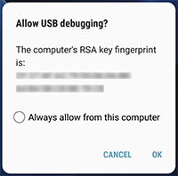
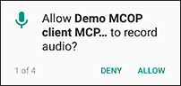
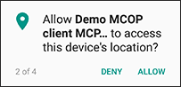
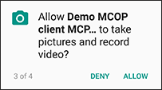
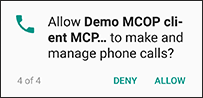
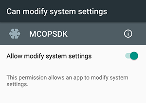
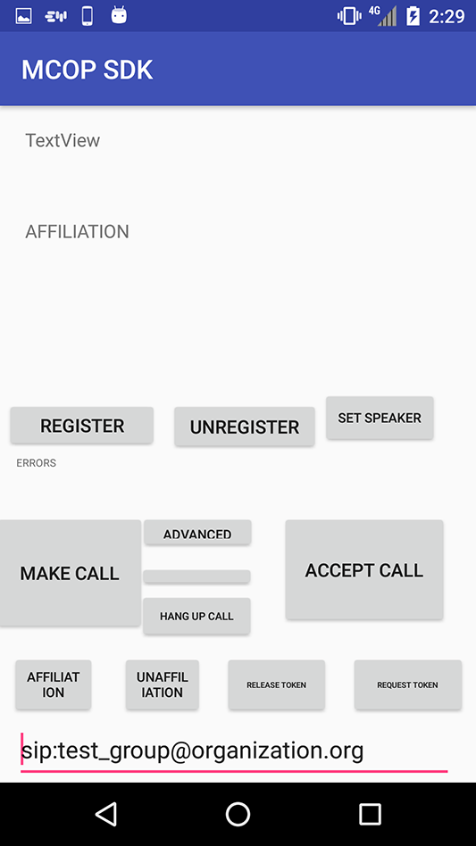

> *Refer to* [*README*](../README.md) *for main instruction file*

# MCOP SDK

## Installation

### Requirements

* [**Provisioning App**](Provisioning.md) to configure the users and bypass the the SIM authentication.

### Download the MCOP SDK

Clone or download the project:

	$ git clone mcop@demo.mcopenplatform.org:mcop/MCOP-SDK.git

Enter the password: Iephieb8

### Install Android Studio

* Android Studio [User Guide](https://developer.android.com/studio/install).

* Download [Android Studio](https://developer.android.com/studio/).

### Android SDK Tools

Once Android Studio is installed, click on **SDK Manager** , go to **SDK Tools** and make sure that **CMake**, **LLDB** and **NDK** are installed.

### Install MCOP SDK

Import the project in Android Studio by selecting **File --> Open:** Select the **MCOP-SDK** project folder.

Android **SKD Platform 28** is defined as compilation version. If not installed, a message is shown in Android Studio to *"Install missing platform(s) and sync project"*.

Connect a phone to the computer via USB cable. **USB debugging** mode must be previously activated, on phone *Settings --> Developer Options*. Once connected, click OK on *"Allow USB debugging?"* message.

Back on Android Studio, click on run , select the device to install the app, and click on Install and Continue.

Once installed, allow requested permissions:

 

 

### Usage

* Once installed, we can see the **MCOP SDK** installed on our device in the application list.

* The SDK comes built in with a raw interface Test Client *(see the screenshots section below)*.

* For a full user experience, we recommend checking out our [**MCOP MCPTT Client**](https://demo.mcopenplatform.org/gitlist/mcop/MCOP-MCPTT-Client.git/blob/master/docs/MCOP_MCPTT_Client_Installation.md), with a full GUI interface.

* Every time the [**MCOP MCPTT Client**](https://demo.mcopenplatform.org/gitlist/mcop/MCOP-MCPTT-Client.git/blob/master/README.md) *(or the mentioned built in Test Client)* is started, it uses the configuration selected in the [**Provisioning App**](Provisioning.md).

* **IMPORTANT**: In order to test the Test Client against our [demo.mcopenplatform.org](https://demo.mcopenplatform.org) testing platform, the user configuration settings provided by email when booking a testing slot need to be updated in the [Provisioning App](https://demo.mcopenplatform.org/gitlist/mcop/MCOP-SDK.git/raw/master/provisioning/MCOP_ProvisioningTool.apk). **Full detailed information is available in [Provisioning Tool](TestingPlatform.md) documentation**.

* Check [MCOP MCPTT App Development](MCOP_App_developing_steps.md) guide for more info on app development using the MCOP SDK.

### Screenshots

Example screenshots of the raw test client that comes built in with the SDK.

### Possible Errors

* If you have SIP related problems, maybe your carrier is SBC/filtering VoIP traffic. Please check the [Troubleshooting - Network Issues](Troubleshooting.md) section for more information.

